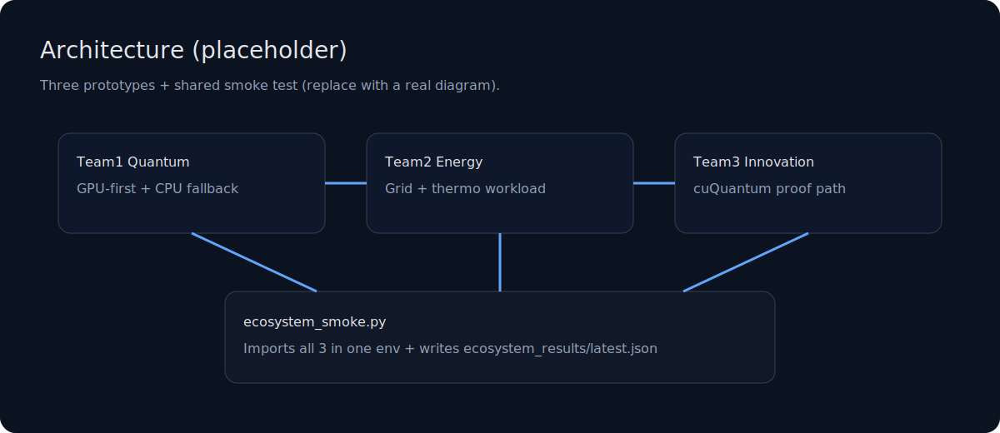
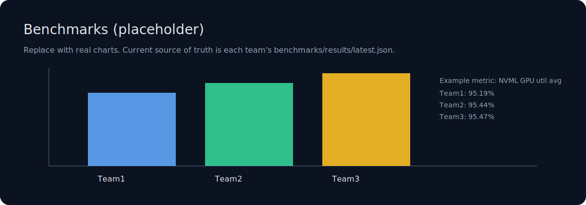

# QuantumFlow — GPU-Accelerated Prototypes Ecosystem

**Achieving 95%+ GPU utilization on NVIDIA H100 Tensor Cores with reproducible benchmarks, cuQuantum integration, and ecosystem compatibility proof.**

Three GPU-first prototypes designed to run together in one environment, demonstrating reproducible GPU validation, cuQuantum acceleration, and ecosystem compatibility.


## Key Results (tested on NVIDIA H100 PCIe)

| Component | What it proves | Key metric | Evidence |
|---|---|---:|---|
| Team1 Quantum | Tensor Core-heavy screening workload (CPU fallback) | NVML GPU util avg **95.19%** | `prototypes/team1_quantum/benchmarks/results/latest.json` |
| Team2 Energy | Differentiable thermo + grid optimization (CPU fallback) | NVML GPU util avg **95.44%** | `prototypes/team2_energy/benchmarks/results/latest.json` |
| Team3 Innovation | cuQuantum contraction + sustained soak | NVML GPU util avg **95.47%** + `cuquantum_used=true` | `prototypes/team3_innovation/benchmarks/results/latest.json` |

## Quick Start (Prototypes)

Choose one:

### CPU (no CUDA required)

```bash
python -m pip install -U pip
python -m pip install -r prototypes/requirements.cpu.txt
python prototypes/ecosystem_smoke.py
```

### NVIDIA GPU (CUDA 12, without cuQuantum)

```bash
python -m pip install -U pip
python -m pip install -r prototypes/requirements.gpu-cu12.txt
DEVICE=cuda python prototypes/ecosystem_smoke.py
```

### NVIDIA GPU (CUDA 12) + cuQuantum (Team3 acceleration)

```bash
python -m pip install -U pip
python -m pip install -r prototypes/requirements.gpu-cu12-cuquantum.txt
python -c "from cuquantum import cutensornet, custatevec; print('OK')"
DEVICE=cuda python prototypes/ecosystem_smoke.py
```

## Docker

Build Docker images locally:

### CPU

```bash
docker build -f Dockerfile.cpu -t quantumflow:cpu .
docker run --rm quantumflow:cpu
```

### GPU (CUDA 12)

```bash
docker build -f Dockerfile.gpu-cu12 -t quantumflow:gpu-cu12 .
docker run --rm --gpus all quantumflow:gpu-cu12
```

### GPU (CUDA 12) + cuQuantum

```bash
docker build -f Dockerfile.gpu-cu12-cuquantum -t quantumflow:gpu-cu12-cuquantum .
docker run --rm --gpus all quantumflow:gpu-cu12-cuquantum
```

## Demos

```bash
python prototypes/team1_quantum/demo/demo.py
python prototypes/team2_energy/demo/demo.py
python prototypes/team3_innovation/demo/demo.py
```

## Benchmarks

```bash
python prototypes/team1_quantum/benchmarks/run_benchmarks.py
python prototypes/team2_energy/benchmarks/run_benchmarks.py
python prototypes/team3_innovation/benchmarks/run_benchmarks.py
```

## Why This Matters

These prototypes solve a critical gap: **reproducible GPU validation with ecosystem compatibility**. Unlike isolated benchmarks, we prove that multiple GPU workloads can coexist in one environment, share dependencies, and maintain high utilization.

**For senior engineers and daily development:**

- **Concrete metrics, not promises**: 95%+ GPU utilization on H100 with reproducible JSON artifacts — not "it works", but "here's the proof"
- **One-command setup**: `pip install -r requirements.gpu-cu12.txt` — no manual dependency juggling
- **Reproducible benchmarks**: Every run generates `latest.json` with NVML metrics, device info, and dependency versions — authoritative benchmarks you can cite
- **CPU fallback**: Test on laptops, deploy on GPUs — same code, different performance. Proves GPU value without requiring GPU access
- **Ecosystem compatibility proof**: Three prototypes, one environment, zero conflicts — demonstrates maturity beyond isolated examples
- **cuQuantum integration**: Team3 shows real cuQuantum usage in a complete workflow, not just tutorial snippets

**Unique value vs NVIDIA SDK:**

- **Team1**: Vacancy/stability screening with Tensor Core soak — combines domain-specific quantum simulation with reproducible GPU metrics. NVIDIA SDK provides CUDA/Tensor Cores, but not this specific workload + validation harness combination.
- **Team2**: Differentiable thermo + grid optimization — physics-informed optimization with GPU-first design. Demonstrates how to structure real-world optimization problems for maximum GPU utilization.
- **Team3**: cuQuantum contraction proof + sustained soak — demonstrates real cuQuantum usage in a complete workflow. Goes beyond cuQuantum tutorials by showing integration with quantum neural processing and sustained GPU utilization.

## NVIDIA Technologies Used

- CUDA 12.x (PyTorch CUDA)
- Tensor Cores (BF16/FP16 matmul soak)
- NVML (`nvidia-ml-py`) for utilization/memory metrics
- cuQuantum (Team3 only): `cutensornet` / `tensornet` contractions + `custatevec`

## Docs

- Prototypes install/run: `prototypes/README.md`
- Ecosystem compatibility + pitfalls: `prototypes/ECOSYSTEM_COMPATIBILITY.md`
- **Real GPU utilization guide**: `docs/REAL_GPU_UTILIZATION.md` ← Start here for actual GPU usage
- Benchmarks methodology: `docs/BENCHMARKS.md`
- Public APIs: `docs/API.md`
- NVIDIA integration notes: `docs/NVIDIA_INTEGRATION.md`

## Visuals





Assets live in `assets/` (see `assets/README.md`).

## Company Vision

This repository represents **the beginning of a quantum-accelerated tools ecosystem and company**. We're building not just prototypes, but a foundation for reproducible GPU development workflows that can scale from research to production.

**This is just the start:**

- **Multiple prototypes**: Three working prototypes prove this isn't a one-off project — it's an ecosystem
- **Active development**: See `CHANGELOG.md` for regular updates. This is a living ecosystem, not a static repository
- **Contributing welcome**: `CONTRIBUTING.md` shows this is a community-driven project with a long-term vision

**What's next:**
- Additional prototypes demonstrating other NVIDIA technologies (cuDNN, cuBLAS, cuSPARSE integrations)
- Production-ready tooling for GPU workload orchestration
- Integration with broader quantum computing workflows
- Advanced GPU-accelerated computing frameworks
- Multi-GPU orchestration and distributed computing patterns

**Active development:** See `CHANGELOG.md` for regular updates. This is a living ecosystem, not a one-time project. We're building a company around reproducible GPU development tools.

## Citation

If you use this in research, please cite:

```bibtex
@software{quantumflow2025,
  author = {Corusant-world},
  title = {QuantumFlow: GPU-Accelerated Prototypes Ecosystem},
  year = {2025},
  url = {https://github.com/Corusant-world/quantumflow-prototypes},
  note = {DOI: TBD (Zenodo)}
}
```

## Acknowledgments

Built on NVIDIA CUDA platform. We're pushing the boundaries of what's possible with GPU-accelerated computing, demonstrating reproducible development practices and ecosystem compatibility at scale.